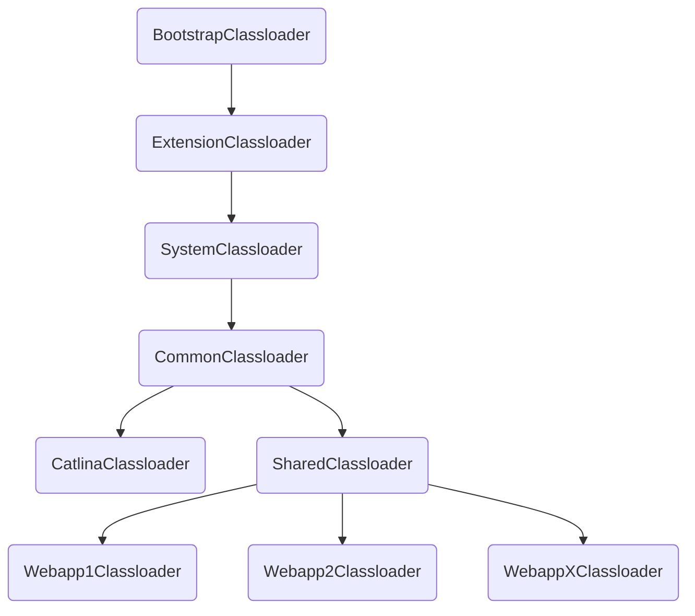

- @JsonComponent
  - 支持扫描内部类
<!--more--> 
    ```java
    //源码摘要
    //JsonComponentModule#addJsonBean
    private void addJsonBean(Object bean, Class<?>[] types, Scope scope) {
    		if (bean instanceof JsonSerializer) {
    			addJsonSerializerBean((JsonSerializer<?>) bean, scope, types);
    		}
    		else if (bean instanceof JsonDeserializer) {
    			addJsonDeserializerBean((JsonDeserializer<?>) bean, types);
    		}
    		else if (bean instanceof KeyDeserializer) {
    			addKeyDeserializerBean((KeyDeserializer) bean, types);
    		}
    		for (Class<?> innerClass : bean.getClass().getDeclaredClasses()) {
    			if (isSuitableInnerClass(innerClass)) {
    				Object innerInstance = BeanUtils.instantiateClass(innerClass);
    				addJsonBean(innerInstance, types, scope);
    			}
    		}
    }
    ```

- ResolvableType：springboot扫描泛型，jackson自定义序列化使用到这个进行相关注册

  ```
  ResolvableType.forClass(JsonDeserializer.class, deserializer.getClass()).resolveGeneric()
  ```

- Fieled.getGenericType: jdk自带泛型扫描

  ```java
  Fieled field=XXXClass.getClass.getDeclaredField("xxx");
  field.getGenericType();
  ```

- ObjectProvider: springboot的一种接口、可以作为AutoWired注入不存在bean抛错的一种替代方案
  see: ObjectFactory

- @LookUp: springboot单例bean注入原型bean的一种方法，可替代ApplicationContextAware的一种实现
  ```java
  @LookUp
  public Bean getXXX(){return null}
  ```

- jackson序列化： objectMapper.setDateFormat最好设置非线程安全的SimpleDateFormat（内部使用clone、synchronized等手段保证线程安全）

  ```
  例如：
  DateTimeSerializerBase#_serializeAsString
  DateDeserializers#_parseDate
  ```

- tomcat classloader结构(classloader名称与实际类名有差异、具体需查阅资料)



- springboot @Scheduled特殊描述
  - 使用<font color="red">java反射getDeclaredMethods获取</font>,故类所有的方法都可以获取到并进行定时调度
  - 注解处理类：ScheduledAnnotationBeanPostProcessor.class
  - 默认线程池大小为1，可能导致堆积
  - 默认使用的ScheduledThreadPoolExecutor使用DelayedWorkQueue，内部缓存了系统时间、修改系统时间不影响下次执行时间

- 抽象类使用@Autowired规则
  - 增加对应属性的setXXX方法，在方法上加上@Autowired，并标注为final防止子类重写

  - @Transactional基于代理模式
  - 相关类：TransactionInterceptor.class,TransactionAspectSupport.class等
  - <font color="red">除了private、其他情况都可以成功走代理</font>
  
- spring aop

  - 分为jdk和cglib

  - cglib底层使用ASM编制

  - spring环境中，private和final都无法代理、其中jdk代理报错，cglib无报错但代理失效

  - cglib脱离spring单独使用可以

  - spring中有三种实现
      
      - AopProxy
          JdkDynamicAopProxy
          CglibAopProxy
            ObjenesisCglibAopProxy：Objenesis作为对象new的一种方法
      
      - ProxyCreatorSupport#createAopProxy：创建AopProxy对象
      
      - <font color="red">Objenesis</font>
      
          java存在class.newinstance(),但是需要合适的构造函数，大多数情况会遇到一下情况
      
          - 构造函数需要参数
          - 构造函数抛异常
          - 有副作用的构造函数
      
          Objenesis旨在绕过对象的构造函数克服以上的问题